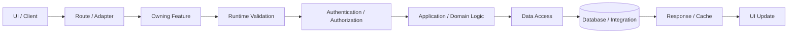
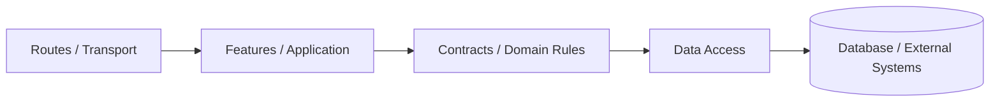

<div align="center">


# Scalable Architecture Skill

**A vendor-neutral architecture decision framework and reusable playbook for AI coding agents.**

Turn product requirements into maintainable system boundaries, applications, features, contracts, backend operations, data access, persistence, shared packages, and infrastructure — **without blindly applying a fixed folder template.**

[](https://www.npmjs.com/package/scalable-architecture-skill)
[](./LICENSE)
[](https://nodejs.org)
[](https://github.com/KOUSHIKG04/scalable-architecture-skill/actions)
[](https://github.com/KOUSHIKG04/scalable-architecture-skill/pulls)

[Quick Start](#-quick-start) • [Core Idea](#-core-idea) • [What It Optimizes For](#-what-this-skill-optimizes-for) • [When to Use](#-when-to-use-it) • [Agent Usage](#-agent-usage) • [Dependency Model](#-important-dependency-model) • [Scaling Philosophy](#-scaling-philosophy)

</div>

---

## ⚡ Quick Start

Initialize the architecture skill, templates, references, and examples into your project in seconds:

```bash
# Using npm
npx scalable-architecture-skill init

# Using pnpm
pnpm dlx scalable-architecture-skill init

# Using bun
bunx scalable-architecture-skill init
```

This installs `SKILL.md`, `references/`, `templates/`, and `examples/` directly into your workspace.

---

## 💡 Core Idea

> **Architecture is a decision system, not a folder template.**

```mermaid
flowchart LR
    REQ(["Requirements"]) --> SYS["System Architecture"]
    SYS --> APP["Application Boundaries"]
    APP --> REPO["Repository Architecture"]
    REPO --> FEAT["Feature Ownership"]
    FEAT --> CONTRACT["Contracts / APIs"]
    CONTRACT --> LOGIC["Application & Domain Logic"]
    LOGIC --> DATA["Data Access"]
    DATA --> DB[("Database")]
    DB --> INFRA["Infrastructure"]
    INFRA --> IMPL(["Implementation"])
```


---

## 🎯 What This Skill Optimizes For

| Dimension | Architectural Goals |
| :--- | :--- |
| **Requirements & Boundaries** | • Requirement-driven architecture<br>• Clear application and deployment boundaries<br>• Feature-first organization |
| **Separation & Coupling** | • Thin route/framework adapters<br>• One-way dependency flow<br>• Controlled shared packages<br>• Platform-aware UI reuse |
| **Correctness & Security** | • Runtime validation and type safety<br>• Trusted authorization boundaries<br>• Database isolation |
| **Long-Term Evolution** | • Explicit state ownership<br>• Evolutionary scalability<br>• Machine-enforceable architecture rules |

---

## 🧭 When to Use **It**

<table width="100%">
<tr>
<th width="50%" align="left">💡 <b>TIP — When to Use</b></th>
<th width="50%" align="left">⚠️ <b>WARNING — When NOT to Use</b></th>
</tr>
<tr>
<td width="50%" valign="top">

• Starting a new product that may grow beyond one small app<br>
• Designing a TypeScript monorepo<br>
• Building web + mobile + admin/operations clients<br>
• Restructuring a codebase that has unclear ownership<br>
• Asking an AI coding agent to scaffold a scalable project<br>
• Defining architecture before feature implementation

</td>
<td width="50%" valign="top">

• Do <b>not</b> force a monorepo, microservices, repository layers, global state, or shared packages onto a project that does not need them.<br><br>
• Every architectural layer, package, and boundary must be justified by a real requirement.

</td>
</tr>
</table>

---

## 🤖 Agent Usage

Feed `SKILL.md` to your AI coding agent together with your project requirements, following this 3-phase workflow:

### Phase 1: Architecture Discovery & Proposal

Provide your agent with `SKILL.md` and your `REQUIREMENTS.md`.

```text
Read SKILL.md completely and treat it as the architecture decision framework for this project.

Read REQUIREMENTS.md.

Do not create or modify project files yet.

Produce:
- Requirement interpretation
- Architecture decisions and trade-offs
- System architecture
- Application/deployment boundaries
- Repository tree
- Application and feature architecture
- Backend architecture
- Database architecture
- Shared package strategy
- Dependency rules
- Critical request/data flows
- Authentication and authorization strategy
- Environment/config strategy
- Testing strategy
- Scalability strategy
- Architecture guardrails
- Initial implementation plan

For every proposed application, package, service, global store, cache, queue, or architectural layer, state the concrete requirement that justifies it.

Remove unjustified abstractions.

Wait for architecture approval before scaffolding implementation.
```

---

### Phase 2: Architecture Approval & Vertical Slice Scaffolding

Once you review and approve the proposal, instruct the agent to scaffold:

```text
Architecture approved.

Scaffold the project according to the approved architecture and SKILL.md.

Create only currently justified applications, packages, directories, and infrastructure.

Configure workspace tooling, TypeScript, linting, formatting, environment validation, tests, and architecture-boundary checks.

Do not implement every product feature.

Implement one minimal end-to-end vertical slice to prove the architecture.

Run typecheck, lint, tests, architecture checks, and build.
```

---

### Phase 3: Vertical Feature Implementation

Build product features vertically one by one while keeping boundaries intact:




---

## 📦 Toolkit Structure

```text
scalable-architecture-skill/
├── .github/
│   └── workflows/
│       └── architecture.yml          # Automated boundary verification in CI
├── assets/
│   └── icon.svg                      # Skill icon and visual branding
├── bin/
│   └── cli.js                        # CLI runner (npx scalable-architecture-skill init)
├── examples/
│   ├── simple-saas.md                # Single-app SaaS architecture example
│   ├── multi-app-platform.md         # Multi-client (web, mobile, admin) platform
│   └── realtime-platform.md          # Realtime, queue, and worker topology
├── references/
│   ├── architecture-principles.md    # In-depth architectural guidelines
│   ├── dependency-rules.md           # Machine-checkable boundary rules
│   └── scalability-guide.md          # Scaling dimensions and tactics
├── scripts/
│   └── check-architecture.mjs        # Script to assert dependency boundaries
├── templates/
│   ├── REQUIREMENTS.md               # Product requirement specification template
│   └── ARCHITECTURE_PROPOSAL.md      # Standard architectural review template
├── LICENSE                           # MIT License
├── package.json                      # Package metadata and CLI config
├── README.md                         # Documentation and playbook overview
└── SKILL.md                          # Core architectural playbook for AI agents
```

---

## 📈 Scaling Philosophy

The skill distinguishes **four distinct kinds of scale**:

| Scale Dimension | Focus & Resolution |
| :--- | :--- |
| 🧩 **Codebase Scale** | Add features without turning `components/`, `utils/`, `services/`, or global state into dumping grounds. |
| 📱 **Application Scale** | Add new clients while keeping apps independent and moving only genuinely shared responsibilities into packages. |
| 👥 **Team Scale** | Make ownership visible so teams can work on separate features/apps without constant cross-module modification. |
| ⚙️ **Infrastructure Scale** | Begin with the simplest trusted backend and database topology, then introduce caching, queues, workers, realtime, or independent services only when measured requirements justify them. |

---

## 📐 Important Dependency Model



> [!IMPORTANT]
> - **Shared packages never depend on applications.**
> - **Applications never import another application's source.**

---

## 🏛️ Reference Philosophy

This toolkit was generalized from a real multi-application TypeScript architecture containing independently owned mobile/web applications, feature-oriented modules, shared design tokens, platform UI packages, contracts/data-access boundaries, and backend infrastructure.

The reference implementation is evidence for the principles, not a directory tree that new projects must clone.

---

## 📄 License

[MIT](./LICENSE) © [KOUSHIK G](https://github.com/KOUSHIKG04)

